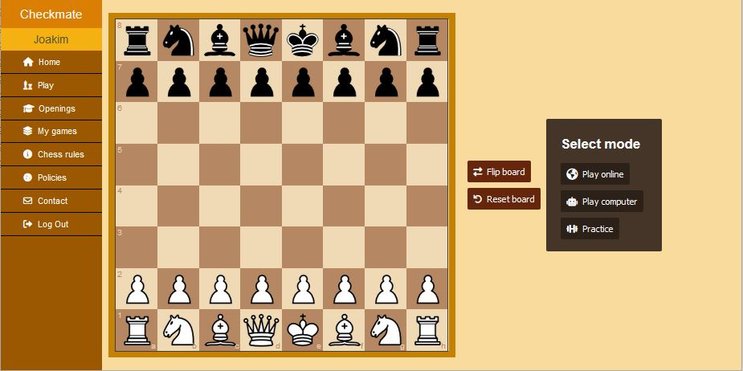
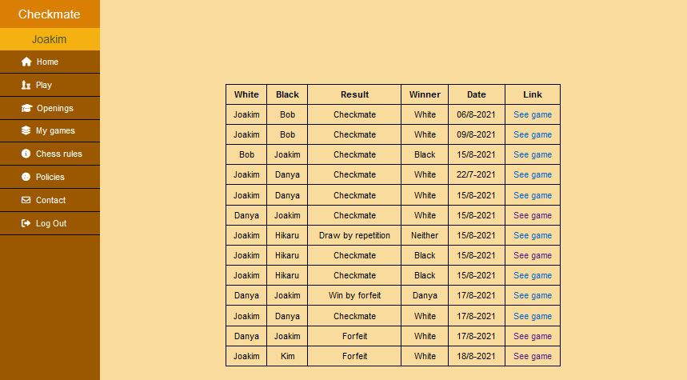

### Features

- Authentication (login and signup)
- Play against other players
- Play against "computer" (it makes random moves)
- Practice mode
- View completed games
- View popular openings
- Page for chess rules, policies and contact (contact is broken)

### Screenshots

### Links

- Live Site URL: [https://tjekmate.herokuapp.com](https://tjekmate.herokuapp.com)

### Built with

- NodeJS
- Express
- SocketIO
- MongoDB
- HTML5
- CSS
- JavaScript

### What I learned

It's my first real project using sockets for real-time updates on the chess board, so that was a learning experience. I also got to try integrating a third party library (the chess logic) which was interesting.
